<div align="center">



**Bienvenido a mi callejón digital, un pequeño espacio donde se aprende cada día** 🌃

</div>

<!-- ╔══════════════════════════════════════════════════╗
     ║  ✏️  RELLENA TUS DATOS EN LOS CAMPOS DE ABAJO     ║
     ║  busca los comentarios con ✏️ o TU_USUARIO        ║
     ╚══════════════════════════════════════════════════╝ -->

## 🧛 Sobre mí

```text
🔭  Ahora mismo estoy estudiando en...   →  ✏️ SENA CSET
🌱  Estoy aprendiendo...                 →  ✏️ Diseño Web y manejo de lenguajes básicos 
👯  Me gustaría colaborar en...          →  ✏️ Manejo y diseño de Páginas llamativas e innovadoras
⚡  Dato curioso...                      →  ✏️ Un buen guía aumenta mis ganas de aprender
```

## 🛠️ Tecnologías y herramientas

<!-- ✏️ borra las que no uses y agrega las tuyas. Lista completa: https://skillicons.dev -->
<div align="center">
  
</div>

## 📊 Mis estadísticas

<div align="center">
  
  
</div>

<!-- 🔒 opcional: racha de contribuciones — descomenta y pon tu usuario
<div align="center">
  
</div>
-->

## 🌐 Conecta conmigo

<!-- ✏️ reemplaza los enlaces por los tuyos -->
<div align="center">

[](mailto:san.study25@gmail.com)
[](#)

</div>
